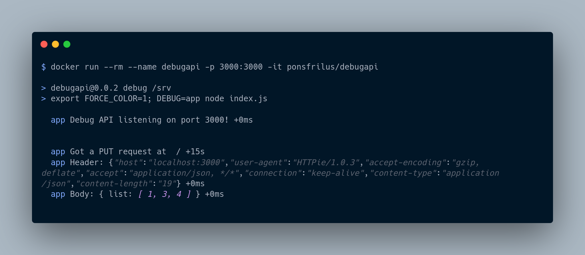

# Debug API

This launch an API endpoint that dump information that you need.



## Usage

  * To run the server, use `export FORCE_COLOR=1; DEBUG=app node index.js`,
  * which is the same as `npm run debug`.
  * You can also use `npm run debug 2>&1 | cat` which will display a ISODate without colors.

## Send data

You can use any tools to send the request, here is some examples:

### [curl](https://curl.haxx.se/) example

```
curl -d '{"good_food":["pizza"]}' -H 'content-type:application/json' "http://localhost:3000"
```

### [HTTPie](https://httpie.org) example

```
http PUT localhost:3000 hello=world
http PUT localhost:3000 list:='[1,3,4]'
```

### [Telnet](https://en.wikipedia.org/wiki/Telnet) example

```
$ telnet localhost 3000
Trying 127.0.0.1...
Connected to localhost.
Escape character is '^]'.
GET / HTTP/1.1

HTTP/1.1 200 OK
X-Powered-By: Express
Content-Type: text/html; charset=utf-8
Content-Length: 21
ETag: W/"15-pUrt2/ReShVqojLi/HerSHIgoCI"
Date: Tue, 08 Oct 2019 12:38:57 GMT
Connection: keep-alive

Got a GET request at /
Connection closed by foreign host.
```

# Docker

## Build

`docker build -t ponsfrilus/debugapi .`

## Run

`docker run --rm --name debugapi -p 3000:3000 -it ponsfrilus/debugapi`
